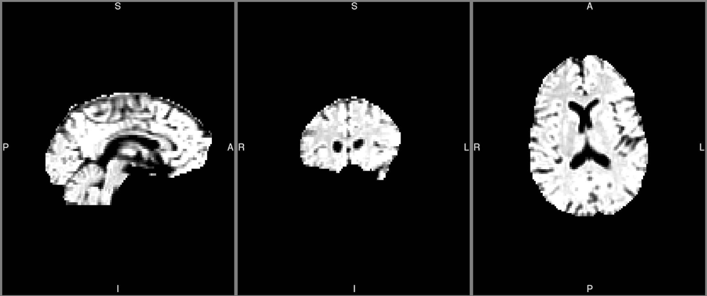
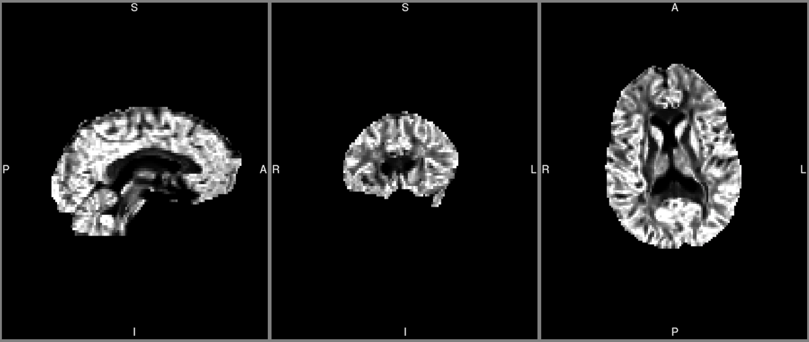

# Tissue-Weighted Mean - Example application to NODDI

## Why Tissue-Weighted Means?

Regions of interest (ROI) that border CSF, such as the corpus callosum, fornix and cortical GM, contain voxels that are part brain tissue and part CSF. This is problematic for calculating ROI means of tissue metrics using the conventional arithmetic mean, which treats all voxels equally, over-weighting the contribution to the mean of voxels with less tissue.

We can account for this by assigning greater importance to voxels with a higher tissue fraction. This can be done by calculating a weighted average of tissue metrics using the tissue fraction estimated from diffusion MRI models that account for CSF contamination (such as NODDI and free water elimination method).

It is important to notice that this bias can occur also in regions of the brain affected by pathological processes, such as atrophy, where healthy grey matter tissue is replaced by CSF.

This tutorial uses NODDI as an example application to explain how to calculate tissue-weighted means of diffusion MRI microstructure tissue parameters. 

## What is NODDI?
NODDI (**N**eurite **O**rientation **D**ispersion and **D**ensity **I**maging) is a microstructural modelling approach for diffusion MRI data [Zhang *et al.*, NeuroImage 2012]. Diffusion within a voxel is modelled using three compartments representing three microstructural environments:

1. Isotropic diffusion compartment (i.e. water in free-flowing regions like the cerebrospinal fluid, CSF). The NODDI model provides this directly as:
  - **ISO**: Isotropic diffusion fraction

The remaining diffusion within a voxel is attributed to brain tissue and split into two compartments:

2. Extra-neurite diffusion compartment (i.e. water outside axons).
3. Intra-neurite diffusion compartment (i.e. water within axons).

  Two microstructural properties of brain tissue can be modelled from the intra-neurite compartment:

   - **NDI**: Neurite Density Index
   - **ODI**: Orientation Dispersion Index

# Tissue-Weighted Mean Tutorial

## Overview

The steps for calculating tissue-weighted means of NODDI tissue parameters **NDI** and **ODI** are below:

1. Generate the tissue fraction (TF) map = **1-ISO**.
2. Voxel-wise multiply both the **NDI** and **ODI** maps by the **TF** map.
3. Extract the ROI mean of **NDI** * **TF**, **ODI** * **TF** and **TF**.
4. Divide mean **NDI** * **TF** and mean **ODI** * **TF** measures by the mean **TF**.

We will use the NODDI outputs from the example NODDI dataset [http://mig.cs.ucl.ac.uk/index.php?n=Tutorial.NODDImatlab] to calculate tissue weighted **NDI** and **ODI** measures for tracts of interest.


## Set up

### Software

This tutorial is performed on the linux terminal (bash) and requires FSL to be installed. We used FSL 6.0.3 but has also been tested on FSL 5.0.9.

### Files

To perform tissue weighted average correction, you will need the following output file from the NODDI preprocessing:

- ISO image (* *_fiso.nii.gz* or *FIT_ISOVF.nii.gz*)
- NDI image (* *_ficvf.nii.gz* or *FIT_ICVF.nii.gz*)
- ODI image (* *_odi.nii.gz* or *FIT_OD.nii.gz*)
- Brain mask for NODDI images (* *_mask.nii.gz*)
- Regions of interest in NODDI image space (* *roi_native.nii.gz*) [for example using the IIT fibres ROIs in this tutorial]

We used AMICO [Daducci *et al.*, NeuroImage 2015] to create our NODDI maps which have the filename convention of `FIT_*.nii.gz`. Details on how we processed the example data used below can be found in `noddi_data/Preprocessing.md`.

To follow this tutorial exactly, download and extract `noddi_data/AMICO_FIT.zip` and `noddi_data/ICBM_native_rois.zip` into the same directory on your computer.

## 1. Generating Tissue Fraction Maps (1-ISO)

First we will create a tissue fraction map (*ISOVF_ftissue*). This is the fraction of the voxel remaining after **ISO** has been calculated and is attributed to tissue (**1-ISO**).

We can calculate **tissue fraction** in one line using FSL by inverting the **ISO** image and adding 1.

```
fslmaths FIT_ISOVF.nii.gz -mul -1 -add 1 -mas NODDI_DWI_mask.nii.gz FIT_ISOVF_ftissue.nii.gz
```

The **tissue fraction map image** should look like below:
### Tissue Fraction Map



## 2. Multiplying NDI and ODI Maps by 1-ISO

We now multiply the **NDI** and **ODI** images by this tissue fraction map to create *modulated* NDI and ODI images. These allow for the tissue weighting calculation to occur on the ROI level later (step 4).

```
fslmaths FIT_ISOVF_ftissue.nii.gz -mul FIT_ICVF.nii.gz FIT_ICVF_modulated.nii.gz
fslmaths FIT_ISOVF_ftissue.nii.gz -mul FIT_OD.nii.gz FIT_OD_modulated.nii.gz
```
The **modulated NDI and ODI images** should look like the below:

### Modulated NDI


### Modulated ODI


## 3. Extracting Regions of Interest Measures

We use ROIs based on fibre bundles from the IIT human brain atlas [ https://www.nitrc.org/projects/iit/ ]. See below for the list of ROIs (see `noddi_data/Preprocessing.md` for details):

- Corpus callosum: `CC_256_roi_native.nii.gz`
- Left Cingulate: `C_L_256_roi_native.nii.gz`
- Right Cingulate: `C_R_256_roi_native.nii.gz`
- Left Corticospinal Tract: `CST_L_256_roi_native.nii.gz`
- Right Corticospinal Tract: `CST_R_256_roi_native.nii.gz`
- Left Uncinate Fasciculus: `UF_L_256_roi_native.nii.gz`
- Left Uncinate Fasciculus: `UF_R_256_roi_native.nii.gz`

We'll now extract these ROI measures for the `modulated NDI`, `modulated ODI` and `tissue fraction` images.

First lets set up a .csv file to store our ROI measures in.

```
echo "NODDI_METRIC,ROI,MEAN,SD" > NODDI_FIBRE_ROIs.csv
```

Then for each of our images, we loop through ROIs, extract measures and store in our csv file `NODDI_FIBRE_ROIs.csv`.

First for modulated NDI:
```
for roi in *roi_native.nii.gz; do istats=(`fslstats FIT_ICVF_modulated.nii.gz -k ${roi} -m -s`); echo mNDI,${roi%_256_roi_native.nii.gz},${istats[0]},${istats[1]} >> NODDI_FIBRE_ROIs.csv; done
```

Then for modulated ODI:

```
for roi in *roi_native.nii.gz; do istats=(`fslstats FIT_OD_modulated.nii.gz -k ${roi} -m -s`); echo mODI,${roi%_256_roi_native.nii.gz},${istats[0]},${istats[1]} >> NODDI_FIBRE_ROIs.csv; done
```

Finally for tissue fraction:

```
for roi in *roi_native.nii.gz; do istats=(`fslstats FIT_ISOVF_ftissue.nii.gz -k ${roi} -m -s`); echo TissueFraction,${roi%_256_roi_native.nii.gz},${istats[0]},${istats[1]} >> NODDI_FIBRE_ROIs.csv; done
```

## 4. Divide Regional NDI and ODI measures by Tissue Fraction

Finally, we have all we need to calculate tissue weighted averages in our csv file `NODDI_FIBRE_ROIs.csv`. The corpus callosum values for each metric is shown below as an example.


| NODDI_METRIC    | ROI     |  MEAN       | SD       |
| -----------     | :----:  | :---------: | :-------:|
| mNDI            | CC      |  0.486252   | 0.138766 |
| mODI            | CC      |  0.146003   | 0.118653 |
| TissueFraction  | CC      |  0.848126   | 0.213132 |

All that remains is to divide the modulated **NDI** and **ODI** ROIs mean values by the corresponding tissue fraction ROI mean values in your software of choice. Doing the following will create the tissue weighted values below:

| NODDI_METRIC    | ROI     |  MEAN       |
| -----------     | :----:  | :---------: |
| NDI_Weighted    | CC      |  0.57332519 |
| ODI_Weighted    | CC      |  0.17214777 |


# NODDI Tissue Weighting Tool

We have included a function in this repository `NODDI-tissue-weighting-tool/scripts/calculate_tissue_weighted_rois.sh` to aid in the calculation of tissue weighted averages.

The command can be run as follows to obtain the spreadsheet created in the tutorial:

```
source NODDI-tissue-weighting-tool/scripts/calculate_tissue_weighted_rois.sh FIT_ISOVF.nii.gz FIT_ICVF.nii.gz FIT_OD.nii.gz NODDI_DWI_mask.nii.gz 256_roi_native NODDI_FIBRE_ROIs.csv
```
